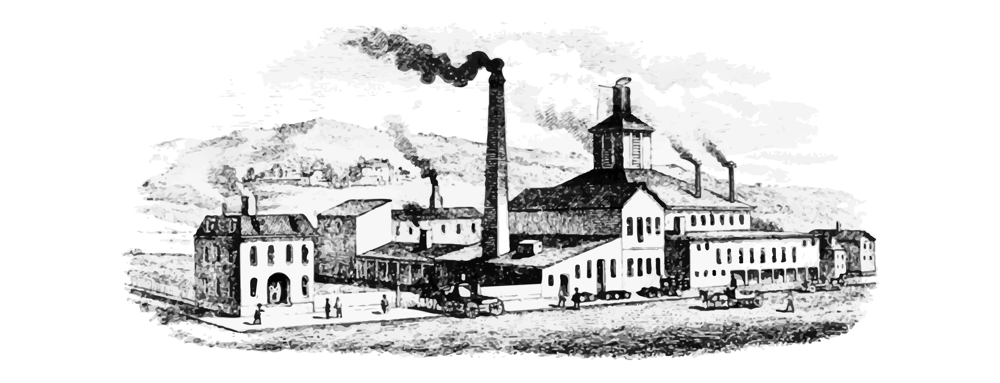

# My projects

## Coal

<p align="center">

</p>

Coal is a statically typed, purely functional programming language with Hindley–Milner type system, algebraic data types, extensible records, traits, and codata. The Coal compiler is implemented in Haskell.

> See the official website for a [language manual](https://coal-lang.org/language-manual/) and getting started instructions:
> 
> Website: <b>[coal-lang.org](https://coal-lang.org/)</b>

### Packages

| Name | Description | 
|----|---|
| 📦 [coal-containers](https://codeberg.org/laserpants/coal-containers) | A collection of functional data structures for the Coal programming language, providing efficient implementations of common container types. |
| 📦 [coal-json](https://codeberg.org/laserpants/coal-json) | A JSON library for the Coal programming language, providing encoding, decoding, and pretty-printing of JSON values with composable decoder combinators and typeclass-based serialization. |
| 📦 [coal-monads](https://codeberg.org/laserpants/coal-monads) | A collection of common monad implementations for the Coal programming language. | 

## IR Builder

A Haskell library for constructing LLVM IR programmatically. It provides a monadic DSL for building modules, functions, blocks, and instructions, along with a pure renderer that serializes the result to LLVM assembly

You describe an IR module using the `IRBuilder` monad. When you run
`compileModule`, the builder produces an `IRModule` value. `renderModule`
then converts that value to the textual LLVM IR format that can be passed
to `llc`, `clang`, or `lli`. For example:

```haskell
import LLVM.IR

example :: IRBuilder ()
example = do
  define i32 "add_one" [(i32, "x")] LExternal [] $ do
    beginBlock "entry"
    r <- add i32 (OLocal i32 "x") (OConstant (CInt 32 1))
    ret r
```

Running `compileModule "example" example` produces:

```llvm
define i32 @add_one(i32 %x) {
entry:
  %1 = add i32 %x, 1
  ret i32 %1
}
```

<p style="margin-top: 2em;">
<a href="https://www.buymeacoffee.com/laserpants"></a>
</p>


